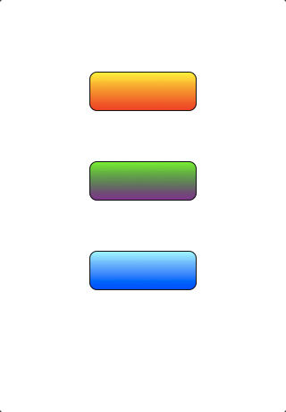
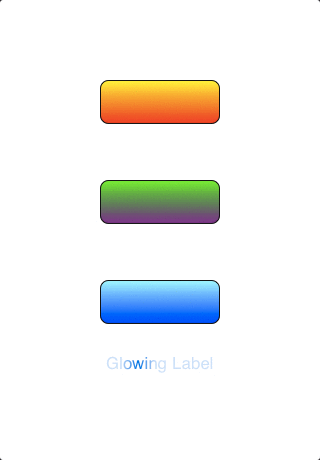

# What it is
I use to work on iOS Development and maintained a set of "helper functions" including

1. generate fade in/out animations
1. generate UIColor object from hex color code
1. add rounded corner context and text with CoreGraphics APIs
1. An customized UIView asking its delegate to implement drawRect, just a way to avoid writing trival UIView inherited classes
1. Label with glowing effect
1. UIButton with gradient effect
1. resize image w/o keeping ratio

# Some examples
As shown in the demo project

It could be very easy to create gradient buttons 

    MPGradientButton *btn1 = [[MPGradientButton alloc]
                             initWithFrame:CGRectMake(100, 100, 120, 44)
                             gradientColors:[NSArray arrayWithObjects:
                                             [UIColor yellowColor],
                                             [UIColor redColor], nil]
                             borderColor:[UIColor blackColor]
                             borderWith:1.0f
                             radius:8.0f];
    MPGradientButton *btn2 = [[MPGradientButton alloc]
                             initWithFrame:CGRectMake(100, 200, 120, 44)
                             gradientColors:[NSArray arrayWithObjects:
                                             [UIColor greenColor],
                                             [UIColor purpleColor], nil]
                             borderColor:[UIColor blackColor]
                             borderWith:1.0f
                             radius:8.0f];
    MPGradientButton *btn3 = [[MPGradientButton alloc]
                              initWithFrame:CGRectMake(100, 300, 120, 44)
                              gradientColors:[NSArray arrayWithObjects:
                                              [UIColor grayColor],
                                              [UIColor blueColor], nil]
                              borderColor:[UIColor blackColor]
                              borderWith:1.0f
                              radius:8.0f];
    [self.window addSubview:btn1];
    [self.window addSubview:btn2];
    [self.window addSubview:btn3];

And create a glowing label, it looks better than this gif in the simulator ...

    
    MPGlowLabel *label = [[MPGlowLabel alloc] initWithFrame:CGRectMake(100, 360, 120, 44)];
    [label setText:@"Glowing Label"];
    [self.window addSubview:label];
    [label resumeGlowing];

